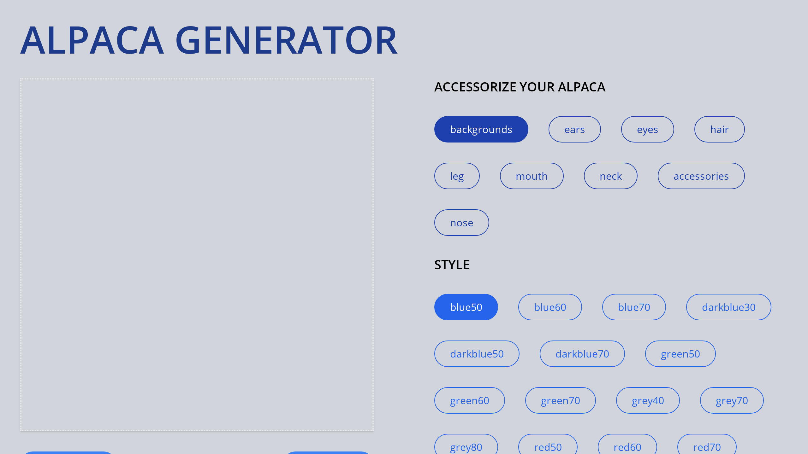

# Alpaca Image Generator Website

This is an open source project from DevProjects that allows users to generate and download avatars of alpacas. The project is built with ReactJS, CSS, and the Merge Images Library. It uses Vite to generate the project.

## Tech/framework used

ReactJS
CSS
Merge Images Library
Vite

## Features

Customization panel for adding different features to the alpaca image
Randomize feature for generating a random alpaca image
Download feature for saving the generated image

## Screenshots and demo

Live demo: [Click to view Live Demo](https://alpaca-image-generator-sigma.vercel.app)

## Problems

During the development of this project, I encountered a few challenges such as rendering styles buttons from a nested array under the buttons for the features.

The biggest obstacle I encountered during this project was maintaining the state for all the components throughout the entire React app. This was my first interactive React project that allowed interaction from the user, so I had a tough but rewarding time implementing the state using the useState hook and props to modify the setup file and render the components accordingly.

## Lessons Learned

I could spend all day describing the lessons I learnt while working on this project, but the most important ones involved my newfound understanding of the useState hook and using external libraries. I also learnt a lot about code structure and modifying Javascript objects in React.

## Getting Started

Clone the repository to your local machine
Install the dependencies by running npm install or yarn install in the project directory
Run the development server with npm run dev or yarn dev
Access the website at http://localhost:3000

## Suggested Implementation

Prepare your image assets. This could include alpaca images or any other images you wish to use for your image generator.
Run the command vite in the project directory to generate the project and start the development server.
Create an alpaca (image) preview UI
Add a list of buttons for customizing your alpaca (image)
Add randomized alpaca feature

## Note

Feel free to use and modify the code for your own projects. Please provide proper attribution and do not use for commercial purposes without permission.